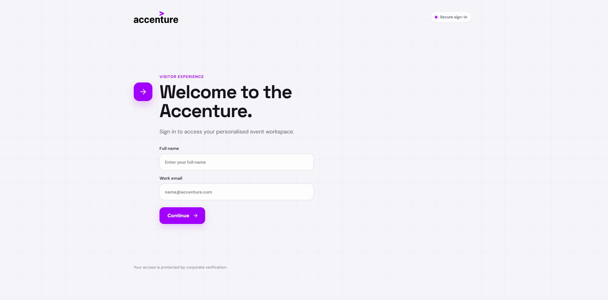

<h1 align="center">
  Visitor Hub
</h1>



## Table of Contents

1. [Project Overview](#project-overview)  
2. [Technologies Used](#technologies-used)  
3. [Key Features](#key-features)  
4. [Application Pages](#application-pages)  
5. [Interface & Visual Quality](#interface--visual-quality)  
6. [Installation and Execution](#installation-and-execution)  
7. [Key Concepts Applied](#key-concepts-applied)  
8. [Contact](#contact)  


## Project Overview

Visitor Hub is a single-page application developed for Accenture corporate events that consolidates the visitor journey into one place. Built with React 19, React Router DOM 7, the React Context API and a custom CSS design-token system, it covers the full event flow: a two-step login, a personalized welcome screen, a dashboard with navigation cards and a keyword-based search assistant, a speaker directory with modal profiles, a two-day schedule with registration controls, a personal agenda with upcoming and past event tabs, a simulated QR code scanner for check-in and networking, a digital badge profile with a live QR code, and a categorized FAQ help center with 15 questions across 5 categories. The interface is a clean light UI with subtle blur and translucency on headers and modals.

## Technologies Used

- **React 19**
- **React Router DOM 7**
- **JavaScript (ES6+)**
- **React Context API**
- **CSS3 (custom properties and page-scoped stylesheets)**
- **Vite 6**
- **Vitest + React Testing Library**
- **ESLint 9**

## Key Features

- **Two-Step Login**: Name and email entry followed by a 6-digit verification code input with auto-focus between digits
- **Mock Authentication**: The code is validated by a mock service layer; only the fixed code `123456` is accepted
- **In-Memory User Context**: Name and email stored with the React Context API; state is cleared on page refresh
- **Protected Routes**: Post-login pages redirect to the sign-in screen when there is no authenticated user in context
- **Personalized Welcome**: Greets the user by first name after login
- **Dashboard**: Navigation cards for every section, a keyword-based search assistant with suggestion chips, a stats grid with four static metrics (registered events, content hours, connections, certificates) and quick action buttons
- **Search Assistant**: Routes to Speakers, Schedule or Profile based on keywords; labeled as "AI assistant" in the UI but built with simple keyword matching
- **Speakers Directory**: Four speaker cards with bio, topics, schedule and location; "View Details" opens a modal with contact info and education
- **Two-Day Schedule**: Tabbed timeline view with category and difficulty badges and registration controls
- **Personal Agenda**: Upcoming and history tabs with status badges (confirmed, waitlist, attended) and display-only star ratings
- **QR Code Scanner**: Fully simulated, with no real camera integration, cycling through three mock result types (event check-in, professional contact, session feedback)
- **Digital Badge & Profile**: Displays user name and email from context, generates a live QR code, supports inline name and department editing, and logs out by clearing context
- **FAQ Help Center**: 15 questions across 5 categories (Events, Platform, Networking, Certificates, My Account) with accordion expand/collapse and category filtering
- **Shared Icon Component**: Inline SVG icon set used across all pages
- **Accessibility Basics**: `:focus-visible` focus styles, `aria-label` on icon-only controls and code fields, `role="status"` on the loading indicator, and `aria-hidden`/`focusable="false"` on decorative icons
- **Responsive Design**: Optimized with `max-width` media queries across breakpoints from 430px to 800px
- **Automated Tests**: 13 tests across four files (user context, protected route, code login and profile) run with Vitest and React Testing Library

> Note: registration, cancellation, certificate download, calendar add, feedback and "Schedule Meeting" actions are `alert()` mocks, and the QR scanner is simulated. These are front-end demo behaviors.

## Application Pages

The application is organized into three route groups, with all post-login routes protected by a route guard.

### Authentication
- **`/` - Login (Email)**: Name and email entry form, the first step of authentication
- **`/login-code` - Login (Code)**: 6-digit code input with per-digit fields and auto-focus; validates `123456`
- **`/loading` - Loading**: 3-second animated transition screen, then redirects to Welcome
- **`/welcome` - Welcome**: Personalized greeting with the user's first name

### Event Discovery
- **`/home` - Dashboard**: Navigation cards, keyword search, stats grid and quick actions
- **`/speakers` - Speakers**: Speaker grid with modal detail view
- **`/schedule` - Schedule**: Two-day tabbed event timeline with registration controls
- **`/faq` - FAQ**: Accordion help center with 5 category filters

### Personal Area
- **`/my-agenda` - My Agenda**: Upcoming and past events with status, materials and certificate indicators
- **`/qr-scanner` - QR Scanner**: Simulated scanner with three mock QR result types
- **`/profile` - User Profile**: Digital badge, live QR code, editable fields, schedule and contacts tabs, and logout

## Interface & Visual Quality

The project implements a consistent, lightweight visual system across every page.

### Visual Design
- Clean light UI with subtle blur and translucency applied to headers and modals
- Consistent card, badge and button styling shared through `App.css`
- Page-scoped stylesheets that keep shared class names from conflicting across routes

### Design Tokens
- Color and border-radius tokens defined as CSS custom properties in the `App.css` `:root` block
- Keyframe animations such as `login-enter`, `dashboard-enter` and `loading-progress`

### Responsive Behavior
- `max-width` media queries with breakpoints from 430px to 800px
- Card grids collapse to a single column, tab bars stack, the schedule timeline switches to a vertical layout, and modal footers stack with full-width buttons on smaller viewports

### Accessibility
- `:focus-visible` styles for keyboard focus on interactive elements
- `aria-label` on icon-only buttons (back, close, edit, search) and on code entry fields
- `role="status"` on the loading indicator
- Semantic headings and landmarks, such as `aria-labelledby` on the dashboard hero

### Dynamic Images
- Live QR code generation through the external `api.qrserver.com` service
- Graceful image fallback with `onError` to a UI Avatars placeholder service

## Installation and Execution

### 1. Clone the repository  
```bash
git clone https://github.com/NatashaBaudelaire/visitor-hub.git
cd visitor-hub
```

### 2. Requirements  
- Node.js 18 or higher (a current LTS release such as Node 20+ is recommended)  
- npm (included with Node.js)  
- Modern web browser

### 3. Run the project
1. Open the project folder in your code editor
2. Install dependencies with `npm install`
3. Start the development server with `npm run dev`
4. Open `http://localhost:5173` in your browser
5. Sign in with any name and a valid email, then use the verification code `123456`

Useful scripts:

```bash
npm run dev      # start the development server
npm run build    # build for production
npm run preview  # preview the production build
npm test         # run the test suite
npm run lint     # run ESLint
```

> Note: Authentication is mocked in the front end. The verification code is read by a local mock service (`authService.js`) and there is no backend or real email delivery, so the fixed code `123456` is required to continue.

## Key Concepts Applied

- React functional components and Hooks (`useState`, `useEffect`, `useRef`, `useContext`)
- React Context API for global user state management
- Client-side routing with React Router DOM and route guards (`ProtectedRoute`)
- Component-based architecture with a shared Icon component and per-page modal implementations
- Mock service layer simulating async authentication flows with `Promise` and `setTimeout`
- Custom CSS design tokens using CSS custom properties defined in `:root`
- Page-scoped stylesheets to keep shared class names from conflicting across routes
- Clean light UI with subtle blur and translucency on headers and modals
- CSS keyframe animations for page and modal transitions
- Responsive design using `max-width` media queries
- Accessibility basics with focus-visible styles and ARIA labels
- Auto-focus management across multi-input forms
- External API integration for QR code image generation
- Graceful image fallback with `onError`
- `navigator.share` Web API with an alert fallback
- Unit and integration testing with Vitest and React Testing Library
- Error handling and user feedback

## Contact

For questions, suggestions, or feedback, please open an issue on the repository or contact directly via GitHub.

**Author**: Natasha Baudelaire ([@NatashaBaudelaire](https://github.com/NatashaBaudelaire)). See the repository contributors list for the full team.

---

> **License**: No license has been defined for this project yet; all rights are reserved by the author.
> **Roadmap**: Planned improvements include a real backend for authentication, database-backed event data, real camera scanning with the already-installed `html5-qrcode` library, PDF certificate generation, calendar synchronization and push notifications.
